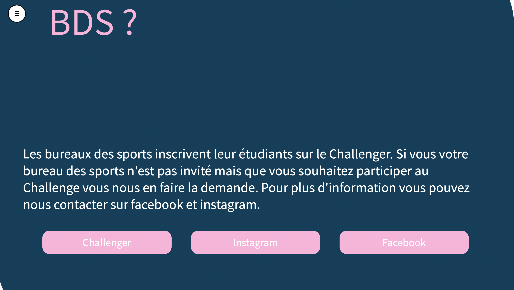
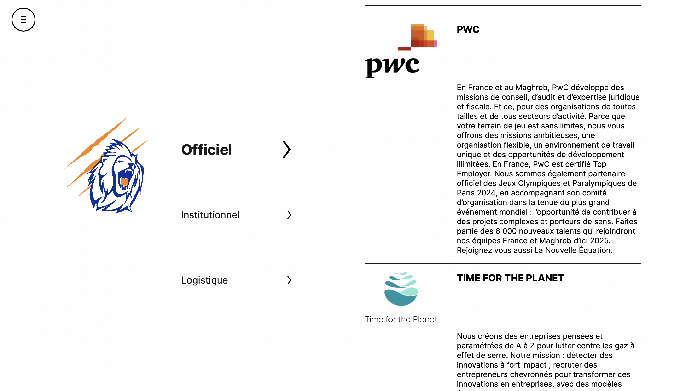

# Centrale Lyon Challenge Showcase

This repository presents the [Challenge Centrale Lyon](https://challenge-centrale-lyon.fr) website. The actual source code of the website is in a private repository due to security concerns.

## Project Overview

The Challenge Centrale Lyon website is a platform for organizing and promoting the annual Challenge Centrale Lyon event. The website provides information about the event's schedule, registration details, sponsors, and more. The website is built using React, Tailwind, HTML5, CSS, Figma and JavaScript

## Features

- Event information and schedule
- Sponsor showcase
- News and updates
- Contact information

## Preview

Here some screenshots :

